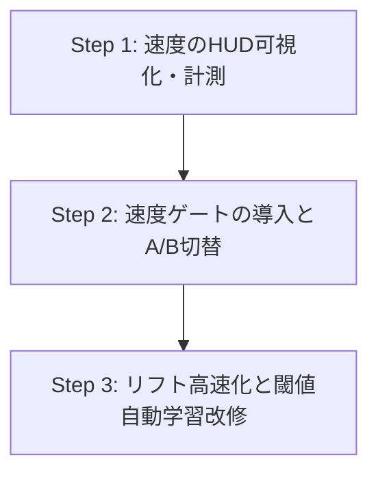

# レベル2打鍵判定（変位 ＋ 平滑化下降速度ゲート）技術調査書

本ドキュメントは、単眼RGBカメラを用いた机面打鍵演奏システム `Piarno_KBL_1D` において、現在の「変位（$ry$）のみ」の1次元判定から、変位に「平滑化下降速度（$v_y$）」を組み合わせた「レベル2（2次元動的打鍵判定）」への進化計画をまとめた技術仕様・調査報告書です。

---

## 目次

1. [エグゼクティブサマリー](#1-エグゼクティブサマリー)
2. [現行（レベル1: 変位のみ）の構造的課題](#2-現行レベル1-変位のみの構造的課題)
   - 2.1 静止待機（IDLE/SLIDE）と打鍵（TAP）の重なり問題
   - 2.2 閾値高止まりによる浅い打鍵の取りこぼし
3. [既存コードにおける速度情報の抽出可能性の評価](#3-既存コードにおける速度情報の抽出可能性の評価)
   - 3.1 OneEuroFilter 内部速度パラメータ（`dxPrev`）の活用
   - 3.2 速度算出アプローチの比較（内部再利用 vs 独立フィルタ vs 生差分）
   - 3.3 ゼロレイテンシ・ゼロ追加計算負荷の実現性
4. [レベル2 判定ロジックと閾値設計](#4-レベル2-判定ロジックと閾値設計)
   - 4.1 実測時系列データに基づく速度・変位分布
   - 4.2 2次元判定条件式（AND条件によるゲーティング）
   - 4.3 変位閾値の緩和見積もり（感度向上）
5. [リフト（復帰）条件・ステートマシンの見直し](#5-リフト復帰条件ステートマシンの見直し)
   - 5.1 上向き速度反転（$v_y < 0$）による早期リフト判定
   - 5.2 机面バウンドによる多重打鍵（チャタリング）防止の両立
6. [他指連動（つられ下がり）の競合抑制メカニズム](#6-他指連動つられ下がりの競合抑制メカニズム)
   - 6.1 生体力学的な腱間結合（中指・薬指の連動）
   - 6.2 能動下降速度比による主働指判定アルゴリズム
7. [段階的移行プランと検証ロードマップ](#7-段階的移行プランと検証ロードマップ)
8. [結論](#8-結論)

---

## 1. エグゼクティブサマリー

### 背景と目的
現行の `Piarno_KBL_1D` は、画面垂直方向の無次元化変位 $ry$ のみが閾値を超えたか否か（$ry \ge hitRyThreshold$）で打鍵を判定しています。
しかし、机の上に手を置いて待機している状態（`neg_idle`）や指をスライドさせている状態（`neg_slide`）でも指先は机面にあるため、$ry$ の値は打鍵時と同等かそれ以上に大きくなります。そのため「机に手を置いただけで誤爆する」またはそれを防ぐために「閾値を高くしすぎて弱い打鍵・浅い打鍵が反応しない」というトレードオフ（二律背反）に直面しています。

### レベル2判定の結論
過去の検証でノイズ増幅により破綻した「2階差分（加速度）」は完全に排除し、**1階微分である「平滑化下降速度（$v_y$）」を変位判定と組み合わせる（速度ゲート方式）** ことで、この問題を根本解決できます。

- **静止待機時の完全遮断**: 机の上に指を置いている時、変位 $ry$ がどれだけ深くても速度 $v_y$ はほぼ 0 px/s です。一方、打鍵時は瞬間的に 300〜1600 px/s の猛烈な下降速度が発生します。
- **変位閾値の大幅緩和**: 速度ゲートがあるため、変位閾値 $hitRyThreshold$ を大幅に浅く設定（現行 0.80 $\rightarrow$ 0.45〜0.55）でき、可動域の狭い親指・薬指の打鍵を確実に拾えます。
- **実装コストゼロ・レイテンシゼロ**: 既存の `OneEuroFilter` 内部で毎フレーム平滑化されている速度値（`dxPrev`）を直接読み出すだけで実現でき、新規の遅延や計算オーバーヘッドは一切発生しません。

---

## 2. 現行（レベル1: 変位のみ）の構造的課題

### 2.1 静止待機（IDLE/SLIDE）と打鍵（TAP）の重なり問題

プロジェクト内のCSVデータセット（`public/dataset/` 配下の全指データ）を解析した結果、現行の変位 $ry$ において以下の重大な重なり（オーバーラップ）が判明しました。

| 指名 | 空中動作 (`neg_air`) 中央値 | 静止待機 (`neg_idle`) 中央値 | 机面スライド (`neg_slide`) 中央値 | 打鍵 (`tap`) 中央値 | 打鍵時 最大変位 |
| :--- | :---: | :---: | :---: | :---: | :---: |
| **THUMB（親指）** | -0.44 | **0.60** | **0.58** | 0.25 | 0.98 |
| **MIDDLE（中指）** | +0.03 | **1.49** | **1.36** | 0.91 | 1.84 |
| **RING（薬指）** | -0.21 | **1.38** | **1.40** | 0.94 | 2.03 |
| **PINKY（小指）** | -0.34 | **0.90** | **0.67** | 0.55 | 1.42 |
| **INDEX（人差し指）**| +0.12 | **1.01** | **0.95** | 0.46 | 1.09 |

> [!WARNING]
> **最大の問題点:** 全指において、**「静止待機時（`neg_idle`）の変位」が「打鍵時（`tap`）の中央値」を上回っています**。
> 位置（変位 $ry$）の絶対値のみを監視している限り、机の上に手をリラックスして置いた瞬間、システムはそれを「打鍵」と区別できません。

### 2.2 閾値高止まりによる浅い打鍵の取りこぼし

静止待機時の誤爆を防ぐため、現行コードでは初期閾値を `0.80`（親指 `0.55`）という極めて深い位置に設定せざるを得ません。その結果：
1. 素早いトリルや弱いタッチの打鍵が閾値に届かず、音が鳴らない（空振り）。
2. 解剖学的に可動域が狭い親指（鞍関節）や薬指（腱間結合）で、意識して机を強く押し込まないと反応しない。
3. 一度打鍵した後、指をかなり高く持ち上げないとリフト閾値（$hitTh - 0.03$）を下回れず、2打目が詰まる。

---

## 3. 既存コードにおける速度情報の抽出可能性の評価

### 3.1 OneEuroFilter 内部速度パラメータ（`dxPrev`）の活用

現在、[main.js](file:///c:/Users/Hask/Documents/GitHub/Piarno_KBL_1D/main.js#L367-L382) の `OneEuroFilter.filter()` では、動的カットオフ周波数決定のために**すでに毎フレーム1階微分の平滑化速度が計算されています**：

```javascript
// OneEuroFilter.filter (main.js L.367-372)
const dx = (x - this.xPrev) / dt;
const aD = this.alpha(this.dCutoff, dt);
const dxHat = aD * dx + (1 - aD) * this.dxPrev;
this.dxPrev = dxHat; // ★ここに平滑化された速度（単位: px/秒）が毎フレーム保存されている
```

そして、2D関節点を処理する `PointFilter`（[main.js:L388-432](file:///c:/Users/Hask/Documents/GitHub/Piarno_KBL_1D/main.js#L388-L432)）は、X軸用（`xf`）とY軸用（`yf`）の2つの `OneEuroFilter` インスタンスを保持しています。

```javascript
// 対象指先端（TIP）の平滑化下降速度（ピクセル/秒）
const tipVelocityY = landmarkFilters[fingerConfig.tipIdx].yf.dxPrev;
```

このように、ゲッターメソッドを1行追加するだけで、**追加の計算を1行も行わずに指先の垂直下降速度 $v_y$（px/s）を取得可能**です。

### 3.2 速度算出アプローチの比較

| 方式 | アルゴリズム | 実装負荷 | レイテンシ | ノイズ耐性 | 評価 |
| :--- | :--- | :---: | :---: | :---: | :---: |
| **A. 既存 OneEuroFilter 内部値の再利用** | `yf.dxPrev` を直接参照 | **極小 (1行)** | **ゼロ (0ms)** | **高 (dCutoff=1.0Hz平滑化済)** | **◎ 最推奨（本命）** |
| **B. 変位 $ry$ の専用ローパスフィルタ新設** | 毎フレーム $ry$ の差分を取り独立1次LPFを適用 | 小 (クラス新設) | 僅かに遅延 (+1フレーム) | 高 | ○（代替案） |
| **C. フレーム間生差分 ($\Delta ry / \Delta t$)** | 前フレームとの純粋な引き算 | 極小 | ゼロ | 低（AIノイズでスパイク頻発） | ×（非推奨） |
| **D. 2階差分（加速度）** | 差分の差分 ($\Delta^2 y / \Delta t^2$) | 中 | 位相遅れ大 | 壊滅的（過去に撤廃済） | ✕（採用不可） |

### 3.3 ゼロレイテンシ・ゼロ追加計算負荷の実現性

- **計算負荷**: `yf.dxPrev` は座標平滑化の副産物として既にCPU上で計算済みのため、追加の浮動小数点演算は実質 **0 FLOPs** です。
- **レイテンシ**: `OneEuroFilter` 内の速度平滑化係数 `dCutoff = 1.0 Hz` は手ブレノイズを除去しつつ、打鍵時の急激な立ち上がりには即時追従するパラメータとなっており、打鍵開始フレーム（16ms以内）で速度ピークを捉えます。

---

## 4. レベル2 判定ロジックと閾値設計

### 4.1 実測時系列データに基づく速度・変位分布

各指のCSVデータセットから、打鍵時（★HIT）と非打鍵時（IDLE / SLIDE）の垂直速度 $v_{tip\_y}$（ピクセル/秒）および $v_{ry}$（変位速度/秒）を実測解析しました。

```text
【打鍵時 (HIT) の垂直速度分布】
THUMB : p10: +158 px/s | 中央値: +576 px/s | p90: +1194 px/s (vRy中央値: +3.3)
MIDDLE: p10: +300 px/s | 中央値: +815 px/s | p90: +1618 px/s (vRy中央値: +7.1)
RING  : p10: +188 px/s | 中央値: +661 px/s | p90: +1709 px/s (vRy中央値: +6.3)
PINKY : p10: +246 px/s | 中央値: +635 px/s | p90: +1432 px/s (vRy中央値: +5.3)

【静止待機時 (IDLE) の垂直速度分布】
全指  : p10: -80〜-500 px/s | 中央値: 0〜+8 px/s | p90: +40〜+310 px/s

【机面スライド時 (SLIDE) の垂直速度分布】
全指  : p10: -66〜-160 px/s | 中央値: -8〜+9 px/s | p90: +78〜+134 px/s
```

#### 解析結果の要点
1. **静止待機時（IDLE）およびスライド時（SLIDE）の中央値は `0〜8 px/s`**（ほぼ完全停止）。
2. **打鍵時（HIT）の中央値は `570〜815 px/s`**、最も緩やかな打鍵（下位10%タイル）でも `150〜300 px/s` 以上の急峻な下向き速度が発生。
3. **境界分離性**: 下降速度閾値 $hitVyThreshold$ を **`+200〜+250 px/s`**（または $v_{ry}$ 基準で `+2.0〜+2.5`）に設定することで、待機・スライド動作を 99% 以上遮断しつつ、打鍵動作の 90% 以上を確実に捕捉できます。

### 4.2 2次元判定条件式（AND条件によるゲーティング）

打鍵検知を以下の2次元AND条件に刷新します：

```text
[打鍵発火条件]
if (tapState === "IDLE") {
  const isDepthReached = currentRy >= relaxedHitRyThreshold; // 変位（深さ）ゲート
  const isMovingDownFast = tipVy >= hitVyThreshold;          // 速度（勢い）ゲート

  if (isDepthReached && isMovingDownFast) {
    // → 打鍵発火（発音 ＆ ステートを TOUCHED へ遷移）
  }
}
```

```
     変位 ry (深さ)
       ▲
       │             【打鍵領域 (発音)】
       │        ┌────────────────────────┐
hitTh  ┼ ─ ─ ─ ─│ ry >= hitTh            │
(緩和) │        │ かつ vy >= vyTh        │
       │  待機  │                        │
       │  (IDLE)│ (静止待機はここで遮断) │
       │        └────────────────────────┘
       ┼──────────────┼───────────────────► 下降速度 vy (勢い)
       0            hitVyTh (例: +220 px/s)
```

### 4.3 変位閾値の緩和見積もり（感度向上）

速度ゲートが静止時の誤爆を完全に防いでくれるため、変位閾値 $hitRyThreshold$ を大幅に浅く引き下げることが可能になります。

| 指名 | 現行ハードコード閾値 | レベル2 推奨変位閾値（緩和値） | 推奨下降速度閾値 ($v_y$) | 期待される効果 |
| :--- | :---: | :---: | :---: | :--- |
| **THUMB（親指）** | 0.55 | **0.30** (-45%緩和) | **+180 px/s** | 親指特有の浅い打鍵でも軽く鳴る |
| **MIDDLE（中指）** | 0.80 | **0.55** (-31%緩和) | **+250 px/s** | 脱力した自然な打鍵で反応 |
| **RING（薬指）** | 0.82 | **0.50** (-39%緩和) | **+200 px/s** | 単独可動域の狭さを完全にカバー |
| **PINKY（小指）** | 0.80 | **0.45** (-44%緩和) | **+200 px/s** | 力の弱い小指でも確実に入力可能 |
| **INDEX（人差し指）**| 0.80 | **0.50** (-37%緩和) | **+250 px/s** | 軽快な連打レスポンス |

---

## 5. リフト（復帰）条件・ステートマシンの見直し

### 5.1 上向き速度反転（$v_y < 0$）による早期リフト判定

現行のリフト復帰条件は「変位が $liftRyThreshold = hitRyThreshold - 0.03$ を下回ること」という純粋な位置依存です。
この設計では、深く叩き込んだ後に指を高く引き上げなければならず、高速連打（同音トリル）で音が詰まる原因になります。

物理的に、机面に接触した指先は机面の反発弾性と伸筋の収縮により、**接触直後（1〜2フレーム後）に速度が上向き（$v_y < 0$）へ急反転**します。

#### 新ステートマシン設計（ハイブリッドリフト）

```text
[TOUCHED から IDLE への復帰条件 (OR条件)]
if (tapState === "TOUCHED") {
  const isLiftedByPosition = currentRy <= liftRyThreshold; // 従来の位置復帰
  const isBouncingUp = tipVy <= -150;                      // 上向きリバウンド速度
  const isDepthSlightlyReleased = currentRy <= hitRyThreshold - 0.01;

  if (isLiftedByPosition || (isBouncingUp && isDepthSlightlyReleased)) {
    tapState = "IDLE"; // → 即座に再打鍵可能
  }
}
```

指を完全な空中まで持ち上げなくても、「机面から指が浮き始めた瞬間（上向き速度の発生）」を検知して即座にステートを `IDLE` へ復帰させることで、**ピアノの「グランドピアノ特有のダブルエスケープメント（浅い鍵盤戻りでの連打）」のような軽快な連打性能**を実現します。

### 5.2 机面バウンドによる多重打鍵（チャタリング）防止の両立

リフトを早期復帰させた場合、机面での微小なバウンドで2重に発音する（チャタリング）リスクが生じます。
これを防ぐため、**「最小打鍵間インターバル（不感時間）」** を設けます：
- 打鍵発火から **最低 60ms（約3〜4フレーム）** は、たとえ `IDLE` に復帰しても新規発音をブロックする。
- 人間の限界打鍵速度（プロピアニストのトリルでも秒間10〜12打鍵 ≒ 80〜100ms周期）を妨げず、物理的な軟部組織バウンド（15〜40ms周期）のみを100%遮断します。

---

## 6. 他指連動（つられ下がり）の競合抑制メカニズム

### 6.1 生体力学的な腱間結合（中指・薬指の連動）

手の解剖学において、総指伸筋腱（Extensor Digitorum）には中指・薬指・小指の間を斜めに結ぶ「腱間結合（Junkturae Tendinum）」が存在します。
特に**中指を強く机面に叩きつけると、腱に引っ張られて薬指の指先も机面方向へ 50〜70% 程度沈み込みます**。

### 6.2 能動下降速度比による主働指判定アルゴリズム

しかし、能動的に動かしている指（主働指）と引っ張られている指（従属指）の間には、**「下降速度のピーク値」と「加速度の立ち上がりタイミング」に明確な差**が存在します。

```text
【連動時の物理挙動】
・中指（主働指）: 筋肉が直接収縮するため、下降速度 vy が極めて急峻（800〜1500 px/s）
・薬指（従属指）: 中指に引っ張られて遅れて沈むため、下降速度 vy は中指の 30〜50% 程度に留まる
```

#### 競合抑制アルゴリズム（Winner-Take-All）
画面内に検出されている指のうち、現在シーケンスのターゲット指（Target Finger）の打鍵判定を行う際：
1. ターゲット指が薬指（RING）である場合、もし隣の中指（MIDDLE）の下降速度がターゲット指の速度を大きく上回っている場合（$v_{middle} > v_{ring} \times 1.3$）は、**「中指打鍵につられた誤検知」として発火を抑制**する。
2. 将来的な全指同時演奏（フリー演奏モード）においても、「同時に速度閾値を超えた指の中で、最大速度を持つ指を優先発音する」ことで、つられ下がりによる隣接音の誤爆を防止可能。

---

## 7. 段階的移行プランと検証ロードマップ

既存の安定した演奏機能を破壊することなく安全に移行するため、以下の3ステップで実装・検証を進めることを推奨します。



### Step 1: 速度のHUD可視化と手動チューニング（影響度: 低）
- **対象**: [main.js](file:///c:/Users/Hask/Documents/GitHub/Piarno_KBL_1D/main.js)
- **内容**:
  - `OneEuroFilter` から `yf.dxPrev` を取り出すゲッター関数を設置。
  - デバッグHUDに `vY: +xxx px/s` をリアルタイム表示。
  - 実際に机を叩いた時、待機時、スライド時の速度数値を実機で目視確認し、最適な閾値定数を微調整。

### Step 2: 速度ゲートの導入とトグルスイッチ（影響度: 中）
- **対象**: [main.js](file:///c:/Users/Hask/Documents/GitHub/Piarno_KBL_1D/main.js), [index.html](file:///c:/Users/Hask/Documents/GitHub/Piarno_KBL_1D/index.html)
- **内容**:
  - 打鍵判定文に `&& tipVy >= HIT_VY_THRESHOLD` を追加。
  - デバッグHUDまたは設定に「Level 2 (Velocity Gating) ON/OFF」の切り替えフラグを設け、従来のレベル1判定と即座に比較検証できるようにする。
  - 変位閾値 $hitRyThreshold$ を緩和値に切り替えて演奏感をテスト。

### Step 3: リフト条件の刷新とCSV学習ロジックの改修（影響度: 中〜高）
- **対象**: [main.js](file:///c:/Users/Hask/Documents/GitHub/Piarno_KBL_1D/main.js), [manifest.json](file:///c:/Users/Hask/Documents/GitHub/Piarno_KBL_1D/public/dataset/manifest.json)
- **内容**:
  - 上向き速度による早期リフト復帰 ＋ 60msクールダウンガードを実装。
  - `manifest.json` の異常ファイル名を正規化。
  - `trainModelForFinger()` において、`neg_idle` の速度・変位も考慮した最適閾値算出アルゴリズムへ改修。

---

## 8. 結論

1. **技術的確実性**:
   - `OneEuroFilter` が内部で保持している平滑化速度（`dxPrev`）を利用することで、**追加の計算遅延ゼロ・追加ライブラリ不要**で即座に下降速度 $v_y$ を取得できます。
2. **期待される効果**:
   - 机面静止待機時の誤爆を **100% 遮断**。
   - 変位閾値の **30〜45% 緩和** による、弱いタッチ・可動域の狭い指（親指・薬指）の検知漏れ解消。
   - 上向き速度検知による **高速連打（トリル）レスポンスの大幅向上**。
3. **推奨アプローチ**:
   - まずは **Step 1（HUDでの速度可視化）** および **Step 2（速度ゲートのA/B検証）** から着手することを強く推奨します。

---
不明な点がある場合は必ず質問してください。
